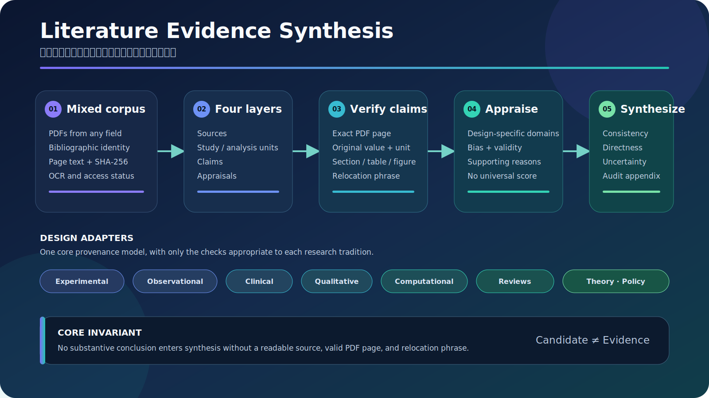

# Literature Evidence Synthesis


> A domain-agnostic Codex Skill for turning mixed PDF collections into traceable evidence matrices and cross-paper synthesis reports.

**中文简介：** 面向所有研究领域的 AI 辅助论文阅读工作流。支持实验、观察、临床、定性、混合方法、计算机与机器学习、方法学、系统综述、Meta 分析、案例、理论、政策和评论性文献。任何进入综合报告的数值、统计结果或实质性结论，都必须回到 PDF 原文页码复核。

<p align="center">
  
</p>

## Why this Skill exists

General-purpose AI readers can summarize almost any paper, but summaries alone are not an auditable evidence base. Common failure modes include:

- mixing a paper with the multiple studies or datasets it contains;
- confusing observations with independent analysis units;
- copying a number from an abstract, review, or secondary citation;
- comparing incompatible metrics, populations, or study designs;
- presenting a qualitative theme or theoretical proposition as an effect estimate;
- converting association, prediction, or interpretation into causation;
- hiding unresolved conflicts behind fluent prose.

This Skill separates **candidate extraction**, **source verification**, **design-aware appraisal**, and **cross-paper synthesis**.

## What changed from the ecotoxicology version

| Earlier specialized model | Universal model |
|---|---|
| Fish, exposure, endpoint fields | Population/material, input, context, outcome/theme |
| One row per paper | Separate source and study-unit layers |
| Toxicology-centered quality rules | Design modules for empirical and non-empirical research |
| Numeric/statistical claim focus | Quantitative, qualitative, methodological, conceptual, and policy claims |
| Single evidence grade | Transparent domain-level appraisal without a forced universal score |

Ecotoxicology remains supported as one optional use case; it is no longer embedded in the required schema.

## Supported literature

| Family | Examples |
|---|---|
| Experimental | laboratory, field, preclinical, engineering tests |
| Observational | cohort, case-control, cross-sectional, archival |
| Clinical | randomized, non-randomized, diagnostic, prognostic |
| Human and social research | surveys, qualitative, ethnographic, mixed methods |
| Computational | machine learning, benchmarks, simulation, modeling |
| Evidence synthesis | systematic, scoping, narrative reviews, meta-analysis |
| Method development | instruments, assays, algorithms, protocols |
| Non-empirical | theoretical, conceptual, humanities, commentary, policy, guidelines |

The schema is extensible: a source may contain zero, one, or many study units.

## The four-layer evidence model

```text
Source
  ├── Study / analysis unit 1
  │     ├── Verified claim
  │     └── Appraisal domains
  ├── Study / analysis unit 2
  │     └── Verified claim
  └── Source-level conceptual or review claim
```

| Table | Role |
|---|---|
| `sources.csv` | Bibliographic identity and full-text status |
| `studies.csv` | Experiments, cohorts, datasets, cases, samples, or analyses |
| `claims.csv` | Page-verified substantive assertions |
| `appraisals.csv` | Design-appropriate quality or bias judgments with reasons |

## Core invariant

> No numerical, statistical, qualitative, methodological, or conceptual conclusion enters the final synthesis without a readable source, a PDF-reader page, and a relocation phrase.

For normalized units or reviewer calculations, the original reported value is always preserved.

## Repository layout

```text
.
├── README.md
├── LICENSE
├── requirements.txt
└── skills/
    └── literature-evidence-synthesis/
        ├── SKILL.md
        ├── agents/
        │   └── openai.yaml
        ├── scripts/
        │   ├── index_pdf_corpus.py
        │   ├── init_evidence_matrix.py
        │   └── validate_evidence_matrix.py
        ├── references/
        │   ├── design-modules.md
        │   ├── evidence-schema.md
        │   ├── synthesis-guidelines.md
        │   └── verification-protocol.md
        └── assets/
            ├── sources-template.csv
            ├── studies-template.csv
            ├── claims-template.csv
            ├── appraisals-template.csv
            ├── evidence-pipeline.svg
            └── evidence-pipeline.png
```

## Installation

Copy the nested Skill folder into the Codex skills directory:

```powershell
Copy-Item -Recurse `
  .\skills\literature-evidence-synthesis `
  "$env:CODEX_HOME\skills\literature-evidence-synthesis"
```

Install the only script dependency:

```bash
python -m pip install -r requirements.txt
```

## Quick start

### 1. Index the PDF corpus

```bash
python skills/literature-evidence-synthesis/scripts/index_pdf_corpus.py \
  ./papers \
  --output ./work/corpus
```

This creates a file inventory, SHA-256 hashes, page counts, OCR warnings, and one JSONL record per PDF page.

### 2. Initialize the evidence matrices

```bash
python skills/literature-evidence-synthesis/scripts/init_evidence_matrix.py \
  --output ./work/evidence
```

### 3. Invoke the Skill

```text
Use $literature-evidence-synthesis to analyze the PDFs in ./papers.
Classify each paper and study design, build the four linked evidence tables,
verify every substantive conclusion against its PDF page, appraise each study
with a design-appropriate framework, and generate a cross-paper report.
```

### 4. Validate before synthesis

```bash
python skills/literature-evidence-synthesis/scripts/validate_evidence_matrix.py \
  --sources ./work/evidence/sources.csv \
  --studies ./work/evidence/studies.csv \
  --claims ./work/evidence/claims.csv \
  --appraisals ./work/evidence/appraisals.csv \
  --pdf-root ./papers
```

Any error is a release blocker. Candidate, conflicting, and unsupported claims remain excluded from definitive conclusions.

## Design-aware routing

The Skill first classifies the design, then loads only the relevant checks:

- controlled experiments: allocation, replication, blinding, missing outcomes;
- observational studies: selection, measurement, confounding, reverse causation;
- qualitative studies: reflexivity, analytic transparency, divergent cases;
- machine learning: split integrity, leakage, metrics, ablation, external validation;
- reviews: search coverage, screening, overlap, bias assessment, synthesis method;
- theoretical papers: definitions, premises, coherence, boundary conditions, testability.

It does not impose one quality score across incompatible research traditions.

## Scientific guardrails

- A paper count is not a study count.
- Repeated observations are not automatically independent samples.
- Statistical significance is not practical importance.
- Absence of significance is not evidence of no effect.
- A review does not replace verification of a cited primary result.
- Benchmark accuracy does not establish deployment validity.
- Theme frequency does not automatically establish qualitative importance.
- A theoretical proposition is not an empirical estimate.
- Correlation, prediction, mediation, mechanism, and causation remain distinct.

## Outputs

A complete run should produce:

1. PDF inventory and OCR exception list;
2. linked source, study, claim, and appraisal matrices;
3. conflict and unverified-claim register;
4. design-aware cross-paper synthesis report;
5. evidence-gap and future-research section;
6. claim-to-source audit appendix.

## Limitations

This Skill does not replace:

- lawful access to full text;
- a preregistered search and screening protocol;
- discipline-specific expert judgment;
- validated risk-of-bias instruments;
- reanalysis of original data;
- causal inference beyond the included evidence.

OCR-poor PDFs must be repaired or marked. The scripts validate provenance and structure; they do not decide whether a scientific conclusion is true.

## Contributing

Contributions are welcome for additional design modules, OCR and table adapters, discipline-specific appraisal mappings, citation exports, and tested examples.

Please preserve the core invariant: **substantive claims require page-level source verification**.

## License

Released under the [MIT License](LICENSE).
