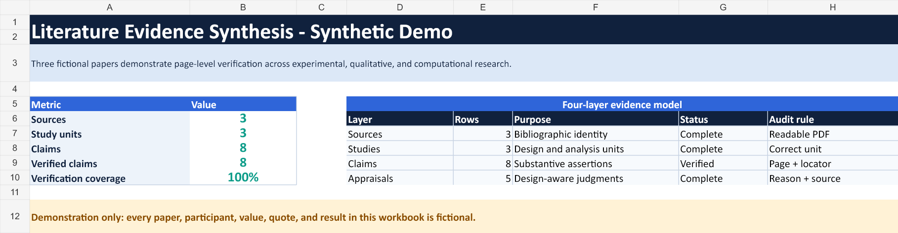
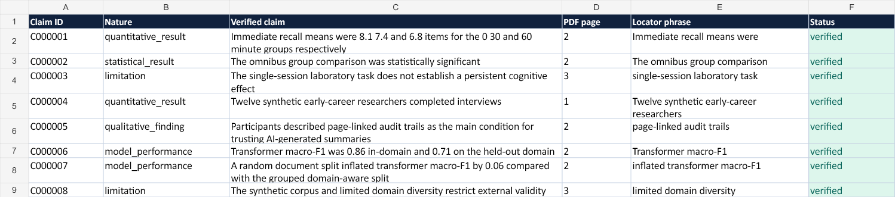
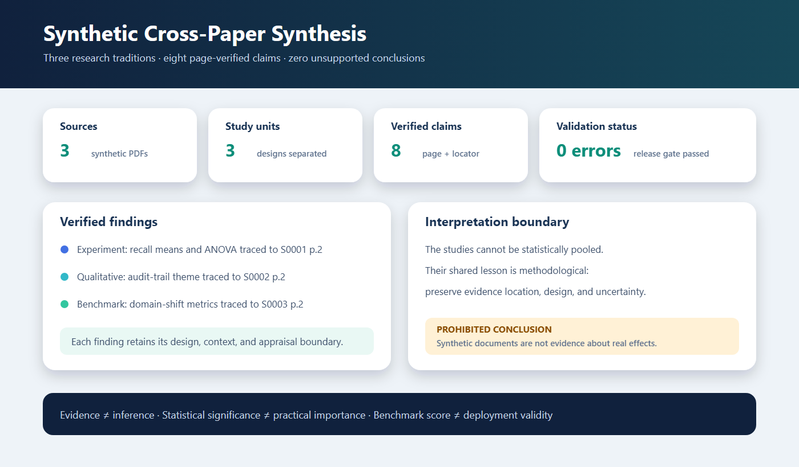

# 文献证据综合

<p align="right">
  <a href="README.md">English</a> · <strong>简体中文</strong>
</p>


> 一个不限定学科的 Codex Skill：将混合 PDF 文献库转换成可追溯的证据矩阵和跨论文综合报告。

本项目支持实验、观察、临床、定性、混合方法、计算机与机器学习、方法学、系统综述、Meta 分析、案例、理论、政策和评论性文献。任何进入综合报告的数值、统计结果或实质性结论，都必须回到 PDF 原文页码复核。

<p align="center">
  
</p>

## 30 秒了解它

把依法获得的全文 PDF 放进一个文件夹，本 Skill 会：

```text
PDF 文献库
  → 建立文献与研究单元清单
  → 提取候选结论
  → 回到 PDF 页码逐条复核
  → 按研究设计评价质量
  → 建立冲突可见的证据矩阵
  → 生成可审计的跨论文综合报告
```

它不是单纯生成“看起来合理”的摘要，而是让审稿人、合作者和未来的你都能重新找到每个结论的原文依据。

## 核心原则

> 没有可读全文、PDF 阅读器页码和原文定位短语的数值、统计、定性、方法学或概念性结论，不得进入最终综合报告。

如果转换单位或重新计算，必须同时保留论文原始数值和单位。

## 支持的论文类型

| 类型 | 示例 |
|---|---|
| 实验研究 | 实验室实验、野外实验、动物实验、工程测试 |
| 观察性研究 | 队列、病例对照、横断面、档案研究 |
| 临床研究 | 随机试验、非随机试验、诊断与预后研究 |
| 人文与社会研究 | 问卷、访谈、定性、民族志、混合方法 |
| 计算研究 | 机器学习、基准测试、模拟、建模 |
| 证据综合 | 系统综述、范围综述、叙述综述、Meta 分析 |
| 方法研究 | 仪器、量表、检测方法、算法和研究方案 |
| 非实证研究 | 理论、概念、人文学术、评论、政策和指南 |

一篇论文可以包含零个、一个或多个独立研究单元。

## 四层证据模型

```text
文献来源
  ├── 研究或分析单元 1
  │     ├── 已复核结论
  │     └── 质量评价
  ├── 研究或分析单元 2
  │     └── 已复核结论
  └── 文献层面的理论、综述或政策结论
```

| 表格 | 作用 |
|---|---|
| `sources.csv` | 题录身份、全文状态和文件位置 |
| `studies.csv` | 实验、队列、数据集、案例、样本或分析单元 |
| `claims.csv` | 已回到 PDF 页码复核的实质性结论 |
| `appraisals.csv` | 与研究设计相匹配的质量或偏倚判断 |

## 快速开始

### 第一步：安装

将仓库中的 Skill 文件夹复制到 Codex Skills 目录。

Windows PowerShell：

```powershell
Copy-Item -Recurse `
  .\skills\literature-evidence-synthesis `
  "$env:CODEX_HOME\skills\literature-evidence-synthesis"
```

安装脚本依赖：

```bash
python -m pip install -r requirements.txt
```

### 第二步：整理 PDF

新建一个只保存合法全文的文件夹，例如：

```text
my-review/
├── papers/
│   ├── paper-01.pdf
│   ├── paper-02.pdf
│   └── paper-03.pdf
└── work/
```

不要把 Sci-Hub 等侵权来源作为工作流的一部分。无法获得合法全文的论文应标记为“需订阅或向作者索取”，不能伪装成已核验全文。

### 第三步：建立 PDF 索引

```bash
python skills/literature-evidence-synthesis/scripts/index_pdf_corpus.py \
  ./papers \
  --output ./work/corpus
```

该命令会生成文件清单、SHA-256、页数、OCR 警告和逐页 JSONL 索引。

### 第四步：初始化证据矩阵

```bash
python skills/literature-evidence-synthesis/scripts/init_evidence_matrix.py \
  --output ./work/evidence
```

### 第五步：在 Codex 中调用

复制下面的提示词：

```text
使用 $literature-evidence-synthesis 分析 ./papers 中的 PDF。
识别每篇文献及其中的独立研究单元，建立四张关联证据表。
所有数值、样本量、统计结果、定性主题和实质性结论必须回到
PDF 原文页码复核，并记录可重新定位的原文短语。
按研究设计选择质量评价框架，最后生成跨论文综合报告。
```

### 第六步：综合前验证

```bash
python skills/literature-evidence-synthesis/scripts/validate_evidence_matrix.py \
  --sources ./work/evidence/sources.csv \
  --studies ./work/evidence/studies.csv \
  --claims ./work/evidence/claims.csv \
  --appraisals ./work/evidence/appraisals.csv \
  --pdf-root ./papers
```

任何错误都应视为综合报告发布阻断项。尚未复核、互相冲突或缺乏支持的结论不得写成确定性结论。

## 演示案例

仓库内置一个完全虚构、采用 CC0 的跨学科案例，包括：

1. 对照实验；
2. 定性访谈；
3. 机器学习基准测试。

| 证据概览 | 已复核结论 |
|---|---|
|  |  |

<p align="center">
  
</p>

进入 [混合文献演示案例](examples/mixed-literature-demo/) 可以查看虚构 PDF、四张 CSV 表、完成版 Excel 证据矩阵和综合报告。演示数据不是真实科研证据。

## 按研究设计评价

- 对照实验：分组、独立重复、盲法、缺失结果；
- 观察性研究：选择偏倚、测量、混杂、反向因果；
- 定性研究：反思性、分析透明度、分歧案例；
- 机器学习：数据划分、泄漏、指标、消融、外部验证；
- 综述：检索覆盖、筛选、重复研究、偏倚评价和综合方法；
- 理论论文：概念定义、前提、逻辑一致性、适用边界和可检验性。

本项目不使用一个统一分数强行比较不相容的研究传统。

## 科学性护栏

- 论文数量不等于独立研究数量。
- 重复观测不自动等于独立样本。
- 统计显著不等于实际重要。
- 不显著不等于证明无效应。
- 综述不能替代对其引用的原始研究进行复核。
- 基准测试准确率不等于实际部署有效性。
- 定性主题出现频率不自动代表主题重要性。
- 理论主张不是实证效应量。
- 相关、预测、中介、机制和因果必须区分。

## 输出内容

完整工作流应生成：

1. PDF 清单和 OCR 异常列表；
2. 关联的来源、研究、结论和质量评价矩阵；
3. 冲突与未复核结论登记表；
4. 按研究设计组织的跨论文综合报告；
5. 证据空白和未来研究建议；
6. 结论到原始来源的审计附录。

## 局限性

本 Skill 不能替代：

- 合法获得全文；
- 预注册检索与筛选方案；
- 学科专家判断；
- 已验证的偏倚风险工具；
- 原始数据重新分析；
- 超出纳入证据的因果推断。

OCR 质量差的 PDF 必须修复或明确标记。脚本只能验证来源追踪和数据结构，不能自动判定科学结论是否真实。

## 参与贡献

欢迎贡献新的研究设计模块、OCR 或表格处理适配器、学科评价框架、引用导出工具和开放演示案例。请先阅读 [贡献指南](CONTRIBUTING.md) 和 [行为准则](CODE_OF_CONDUCT.md)。

请始终保留最重要的规则：**实质性结论必须具有页码级原文复核记录。**

## 许可证

本项目采用 [MIT License](LICENSE)。
